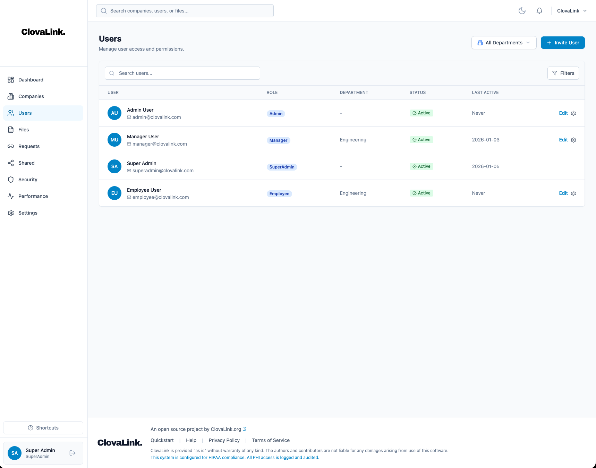
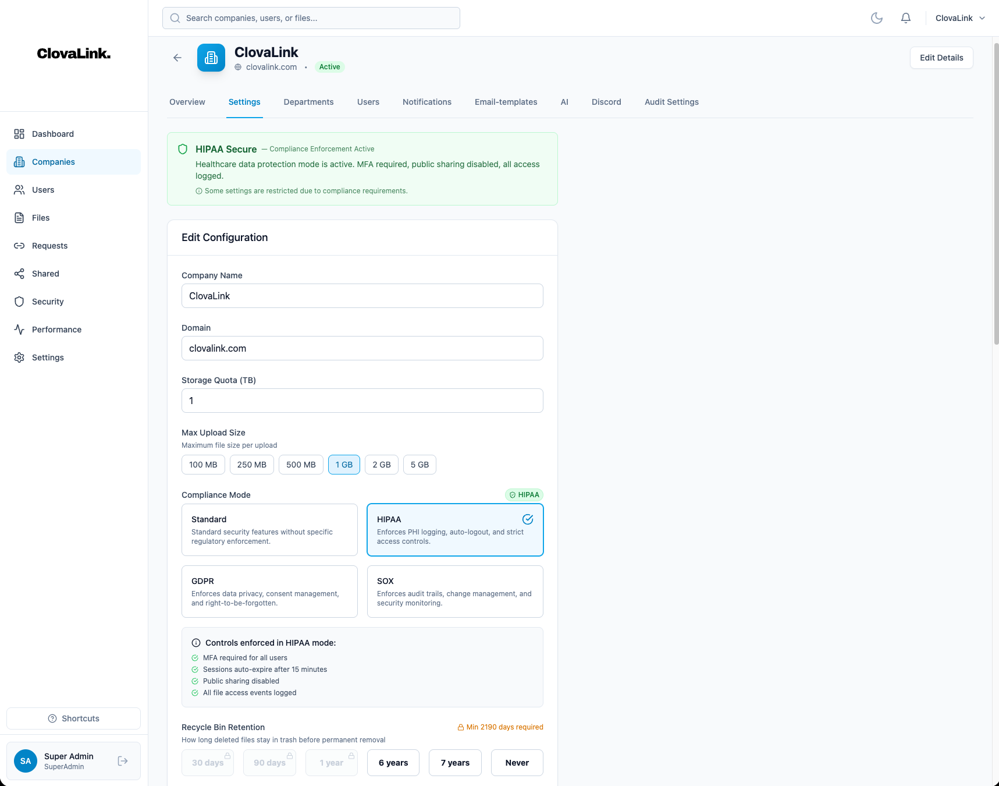

# Admin Guide

This guide covers administration tasks for ClovaLink, including tenant management, user management, compliance configuration, and system settings.

<table>
<tr>
<td width="50%">

<em>User Management</em>

</td>
<td width="50%">

<em>Company Settings</em>

</td>
</tr>
</table>

## User Roles

ClovaLink has four base roles with hierarchical permissions:

| Role | Scope | Key Capabilities |
|------|-------|------------------|
| **SuperAdmin** | Platform-wide | Manage all tenants, global settings |
| **Admin** | Tenant-wide | Manage users, settings, audit logs |
| **Manager** | Department | Create file requests, share files |
| **Employee** | Personal | Upload, download, view files |

### Permission Details

#### Employee
- View files in their department
- Upload files to their department
- Download files they have access to
- Manage their own profile

#### Manager
All Employee permissions, plus:
- Create and manage file requests
- Share files with share links
- Delete files in their department
- View department activity

#### Admin
All Manager permissions, plus:
- View and manage all users
- Invite new users
- Edit user roles and departments
- View audit logs
- Manage tenant settings
- Create custom roles

#### SuperAdmin
All Admin permissions, plus:
- Create and manage tenants
- Delete users permanently
- Manage custom roles
- Export audit logs
- Edit global settings
- Access all tenants

---

## Tenant Management

### Creating a Tenant

*SuperAdmin only*

1. Navigate to **Companies** in the sidebar
2. Click **Add Company**
3. Fill in the details:
   - **Name**: Company display name
   - **Domain**: Unique domain identifier (e.g., `acme.com`)
   - **Plan**: Starter, Business, or Enterprise
   - **Compliance Mode**: Standard, HIPAA, SOX, or GDPR

### Tenant Plans

| Plan | Users | Storage | Features |
|------|-------|---------|----------|
| **Starter** | Up to 10 | 5 GB | Basic file management |
| **Business** | Up to 100 | 100 GB | + File requests, sharing |
| **Enterprise** | Unlimited | Unlimited | + Compliance, extensions |

### Tenant Settings

Access via **Companies** → Select Company → **Settings** tab

#### General Settings
- Company name and domain
- Plan and status
- Storage quota

#### Compliance Settings
- **Compliance Mode**: Sets default security policies
  - *Standard*: No restrictions
  - *HIPAA*: MFA required, no public sharing, 15-min timeout
  - *SOX*: MFA required, no public sharing
  - *GDPR*: Data export enabled, consent tracking
  
#### SMTP Configuration
- Configure email sending for notifications
- Test SMTP connection before saving

#### Authentication
- Enable/disable TOTP (2FA)
- Enable/disable Passkeys
- Session timeout duration
- MFA requirements

### Suspending a Tenant

1. Go to **Companies**
2. Click the menu (⋮) on the tenant row
3. Select **Suspend**
4. Enter a reason (optional)

Suspended tenants:
- Users cannot log in
- API access is blocked
- Data is preserved
- Can be unsuspended at any time

---

## User Management

### Inviting Users

1. Navigate to **Users**
2. Click **Invite User**
3. Fill in:
   - **Email**: User's email address
   - **Name**: Display name
   - **Role**: Select from available roles
   - **Department**: Assign to a department (optional)
   - **Password**: Temporary password

The user will receive a welcome email with login credentials.

### Editing Users

1. Go to **Users**
2. Click on a user row
3. In the user modal, you can:
   - Change name and email
   - Update role
   - Reassign department
   - Reset password

### Suspending Users

1. Click the menu (⋮) on a user row
2. Select **Suspend**
3. Enter:
   - **Reason**: Why the user is being suspended
   - **Until**: Optional end date (or indefinite)

Suspended users:
- Cannot log in
- Existing sessions are invalidated
- Files remain accessible to others
- Can be unsuspended at any time

### Password Reset

#### Admin Reset
1. Go to **Users** → Select user
2. Click **Reset Password**
3. Enter new temporary password
4. User must change password on next login

#### Send Reset Email
1. Go to **Users** → Select user
2. Click **Send Reset Email**
3. User receives email with reset link (expires in 1 hour)

### Permanently Deleting Users

*SuperAdmin only* (GDPR compliance)

1. Go to **Users** → Select user
2. Click **Permanently Delete**
3. Confirm the action

This will:
- Delete all user data
- Anonymize audit log entries
- Remove files owned by user (optional)
- Cannot be undone

---

## Department Management

### Creating Departments

1. Navigate to **Departments**
2. Click **Add Department**
3. Enter:
   - **Name**: Department name
   - **Description**: Optional description

### Assigning Users to Departments

Users can have:
- **Primary Department**: Main department assignment
- **Additional Access**: Access to other departments

To grant additional access:
1. Go to **Users** → Select user
2. In the **Access** section, add departments

### Department File Isolation

Files uploaded to a department are only visible to:
- Users in that department
- Users with additional access to that department
- Admins and SuperAdmins

---

## Custom Roles

### Creating Custom Roles

*Admin or SuperAdmin*

1. Navigate to **Roles**
2. Click **Create Role**
3. Enter:
   - **Name**: Role name (e.g., "Auditor")
   - **Base Role**: Starting permissions template
   - **Description**: Role purpose

4. Configure permissions:
   - Toggle individual permissions on/off
   - Permissions inherit from base role

### Available Permissions

| Category | Permission | Description |
|----------|------------|-------------|
| **Files** | `files.view` | View files and folders |
| | `files.upload` | Upload new files |
| | `files.download` | Download files |
| | `files.delete` | Delete files (to trash) |
| | `files.share` | Create share links |
| **Requests** | `requests.view` | View file requests |
| | `requests.create` | Create file requests |
| **Users** | `users.view` | View user list |
| | `users.invite` | Create new users |
| | `users.edit` | Edit user details |
| | `users.delete` | Delete users |
| **Roles** | `roles.view` | View roles |
| | `roles.manage` | Create/edit roles |
| **Audit** | `audit.view` | View audit logs |
| | `audit.export` | Export audit logs |
| **Settings** | `settings.view` | View settings |
| | `settings.edit` | Modify settings |
| **Tenants** | `tenants.manage` | Manage companies |

### Assigning Custom Roles

1. Go to **Users** → Select user
2. Change **Role** to your custom role
3. Save changes

---

## Audit Logs

### Viewing Audit Logs

Navigate to **Audit Logs** to see all activity:

#### Filters
- **Date Range**: Start and end dates
- **User**: Filter by specific user
- **Action**: Type of action (upload, download, etc.)
- **Resource Type**: Files, users, settings, etc.

#### Logged Actions

| Action | Description |
|--------|-------------|
| `user.login` | User logged in |
| `user.logout` | User logged out |
| `user.created` | New user created |
| `user.updated` | User profile updated |
| `user.deleted` | User deleted |
| `file.upload` | File uploaded |
| `file.download` | File downloaded |
| `file.delete` | File deleted |
| `file.share` | Share link created |
| `file.restore` | File restored from trash |
| `request.create` | File request created |
| `request.upload` | File uploaded to request |
| `settings.update` | Settings modified |
| `role.create` | Custom role created |
| `role.update` | Role permissions changed |

### Exporting Logs

*Admin or SuperAdmin*

1. Go to **Audit Logs**
2. Apply desired filters
3. Click **Export**
4. Choose format (CSV or JSON)

### Audit Settings

Configure what gets logged:

1. Go to **Settings** → **Audit**
2. Toggle categories:
   - Log logins
   - Log file operations
   - Log user changes
   - Log settings changes
   - Log role changes
3. Set **Retention Period** (days to keep logs)

---

## Notifications

### Email Templates

Customize notification emails:

1. Go to **Settings** → **Email Templates**
2. Select a template to edit:
   - Welcome email
   - Password reset
   - File upload notification
   - Request expiring
   - Compliance alerts
   - Security alerts

3. Edit:
   - **Subject**: Email subject line
   - **HTML Body**: Rich email content
   - **Text Body**: Plain text fallback

#### Template Variables

| Variable | Description |
|----------|-------------|
| `{{user_name}}` | Recipient's name |
| `{{company_name}}` | Tenant name |
| `{{app_url}}` | Application URL |
| `{{file_name}}` | File name |
| `{{request_name}}` | Request name |

### Notification Settings

#### User Preferences
Users can manage their own preferences in Profile → Notifications:
- Email on/off per event type
- In-app notifications on/off

#### Tenant-Wide Settings

Admins can enforce notification settings:
1. Go to **Settings** → **Notifications**
2. For each event type:
   - **Enabled**: Allow this notification type
   - **Email Enforced**: Users cannot disable email
   - **In-App Enforced**: Users cannot disable in-app

---

## File Requests

### Creating a File Request

1. Navigate to **File Requests**
2. Click **Create Request**
3. Configure:
   - **Name**: Request title (shown to uploaders)
   - **Destination**: Where uploaded files go
   - **Expiration**: When the request expires
   - **Max Uploads**: Optional limit

4. Share the generated link with external users

### Managing Uploads

1. Go to **File Requests** → Select request
2. View all uploaded files
3. Actions:
   - Download individual files
   - Move to permanent storage
   - Delete uploads

### Request Status

| Status | Description |
|--------|-------------|
| `active` | Accepting uploads |
| `expired` | Past expiration date |
| `completed` | Max uploads reached |
| `closed` | Manually closed |

---

## Storage Management

### Viewing Storage Usage

1. Go to **Dashboard** for overview
2. Or **Settings** → **Storage** for details

Shows:
- Total storage used
- Storage by department
- Largest files
- Storage trends

### Storage Quotas

Set per-tenant limits:

1. Go to **Companies** → Select company
2. Set **Storage Quota** (in bytes)
3. Users receive warnings at 80% and 90%

### Blocked File Extensions

Prevent upload of certain file types:

1. Go to **Settings** → **Security**
2. Add extensions to block (e.g., `exe`, `bat`, `sh`)
3. Uploads of blocked types will be rejected

---

## Global Settings

*SuperAdmin only*

### Application Branding

1. Go to **Global Settings**
2. Customize:
   - **App Name**: Displayed in header
   - **Logo**: Upload custom logo
   - **Favicon**: Browser icon
   - **Footer Text**: Attribution text

### Content Pages

Edit legal/help pages:
- Terms of Service
- Privacy Policy
- Help/Documentation

### Maintenance Mode

1. Go to **Global Settings**
2. Enable **Maintenance Mode**
3. Set maintenance message
4. Only SuperAdmins can access during maintenance

---

## Compliance Features

### GDPR

#### Data Export
Users can export their data:
1. Profile → **Export My Data**
2. Downloads JSON with all personal data

#### Deletion Requests
Handle right-to-be-forgotten requests:
1. Go to **Compliance** → **Deletion Requests**
2. Review pending requests
3. Approve or reject with reason

#### Consent Tracking
View and manage user consent:
1. Go to **Compliance** → **Consent**
2. See consent status per user
3. View consent history

### HIPAA

When compliance mode is HIPAA:
- MFA is required for all users
- Public file sharing is disabled
- Session timeout is 15 minutes
- Audit logging is always on
- Strong password policy enforced

### SOX

When compliance mode is SOX:
- MFA is required
- Public sharing disabled
- File versioning enabled
- All changes tracked in audit log
- No permanent deletion (soft delete only)

---

## Troubleshooting

### User Can't Log In

1. Check user status (not suspended)
2. Verify tenant is active
3. Check password policy compliance
4. Verify MFA setup if required
5. Check IP restrictions

### Files Not Visible

1. Verify user's department assignment
2. Check file visibility setting
3. Ensure file isn't in trash
4. Verify user has `files.view` permission

### Email Not Sending

1. Test SMTP configuration
2. Check spam folders
3. Verify recipient email is valid
4. Check email template for errors

### Storage Full

1. Review largest files
2. Empty trash (deleted files)
3. Increase storage quota
4. Archive old files

### Audit Logs Missing

1. Verify audit settings are enabled
2. Check retention period
3. Ensure actions are configured to log

